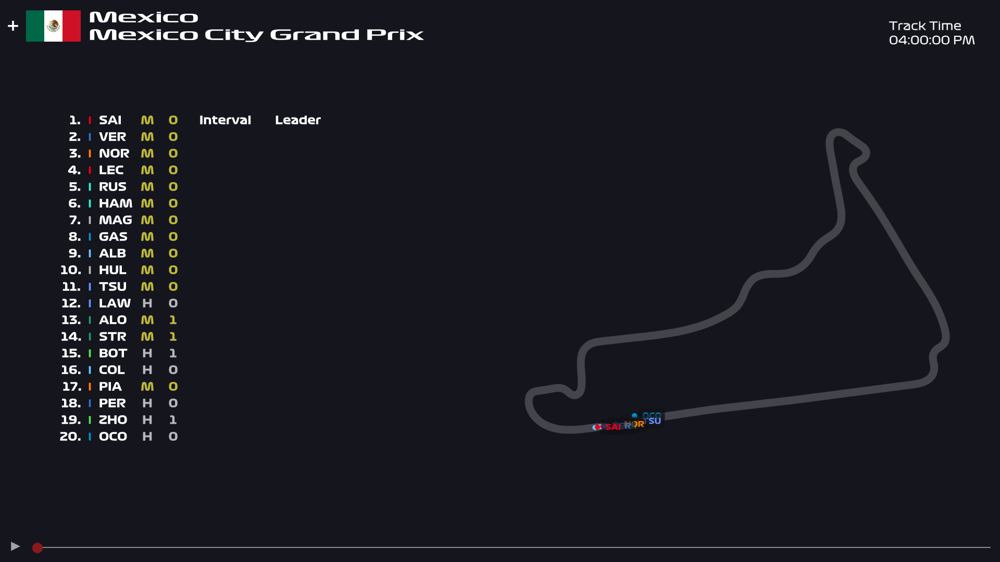

# F1-Visualization-App

**Aplikacija je dostopna na povezavi: ** [https://markloboda.github.io/F1-Visualization-App/](https://markloboda.github.io/F1-Visualization-App/)

Vprašanje: Kakšno je bolj podrobno trenutno, ali preteklo, stanje Formule 1 dirke?

Zanima nas, kakšen je bil potek Formula 1 dirke 27. oktobra 2024 v Mehiki.

Najprej se nam odpre zadnja dirka, ki se je zgodila. V tem trenutku je to dirka v Braziliji 3. novembra 2024.

S pritiskom na gumb "+" zgoraj levo se odpre baza vseh preteklih dirk od začetka sezone 2024 in naprej. V primeru, da je naslednji teden nova dirka, se bo tudi ta samodejno prikazala v tej bazi.

Na seznamu si izberemo dirko "2024 Mexico-Mexico City", torej "Leto Država-Mesto", kjer se je dirka zgodila.

Naloži se nova dirka, kjer lahko vidimo vse, trenutno znane in za ogled pomembne podatke.

Na levi se nahajajo vozniki v vrstnem redu, ki so ga dosegli v kvalifikacijah.
Podatki v tem seznamo so iz leve proti desni sledeči:
- mesto v dirki, kjer se voznik nahaja
- barva ekipe, ki je tudi barva, s katero se voznik riše na progo
- okrajšan priimek voznika (SAI - Sainz)
- oznaka za gumo, ki jo ima trenutno voznik na svojem avtu, ki pa je tudi obarvana za hitrejši pregled (M - medium, H - hard)
- število krogov, ki jih je voznik napravil na tej gumi
- zaostanek pred voznikom, ki je na zaporednem mestu pred opazovanim voznikom
- zaostanek do vodje (prvega mesta) v dirki

Trenutno sta zadnja dva podatka prazna, saj se dirka še ni pričela.

Drugi podatki, ki so trenutno na sliki vidni je še trenuten čas na dirkališču v lokalnem času zgoraj desno in pa trenutna lokacija avta posameznega voznika na progi. Prav tako lahko vidimo izgled proge iz ptičje perspektive, kamor se rišejo lokacije avtov.

Spodaj levo pritisnemo gumb "Play" in začne se izvajati vizualizacija. Z uporabo "sliderja" se lahko premikamo naprej in nazaj po poteku dirke.

Na začetku se prične tako imenovani formation lap, kjer dirkači odpeljejo en krog in se postavijo na svoje startne položaje.

Voznik, označen z oznako OCO (Ocon) je v omenjeni dirki začel v boksih (Pit) in je zato narisan na štartno ciljni ravnini. Počakamo, da se vozniki razvrstijo.

Konec razvrstitve je v lokalnem času 04:03:23 PM.

Ob točno 04:03:37 PM se začne dirka in vozniki se začnejo premikati. Spodaj desno se nam prav tako pokažejo tako imenovana Race Control sporočila, kjer organizatorji dirke sporočajo, kaj se na progi dogaja (yellow flag, prekinitve, kazni za voznike, izbrisani časi krogov...).

Primer še enega sporočila, kjer voznik COL - Colapinto prejme kazen 10 sekund zaradi kontakta.

V tem primeru se izpiše "GREEN LIGHT - PIT EXIT OPEN", ki naznanja, da so boksi odprti in da se je dirkanje pričelo.

S pritiskom na posameznega voznika lahko pogledamo še dodatne informacije o posameznem vozniku. Prav tako se krogec, s katerim je prikazan položaj voznika riše pred vsemi ostalimi in je povečan.s

Zgoraj na ekranu se nam izriše okno, ki vsebuje voznikovo polno ime, njegovo sliko in pa zadnji in najhitrejši čas kroga in posameznega sektorja (odseka) v krogu. Trenutno teh podatkov še ni, saj vozniki še niso odpeljali kroga.

Če se sedaj premaknemo nekoliko naprej v dirki na lokalni čas 04:39:01 PM, lahko vidimo, da so vozniki sedaj opravili že kar nekaj krogov, kjer je v vodstvu enak voznik, ki je bil na začetku dirke (Carlos Sainz) označen z SAI.

Na levi pri voznikih se izriše ikona za najhitrejši čas vozniku, ki je trenutno opravil najhitrejši krog v dirki. S pritiskom nanj lahko vidimo, da je ta čas 82.272 sekund, prav tako pa je zgoraj obarvan vijolično za lažjo razpoznavnost.

V tem primeru so časi posameznih sektorjev vsi obarvani zeleno, saj v najhitrejšem krogu voznik ni odpeljal nobenega sektorja najhitreje v dirki, le skupno je bil v krogu najhitrejši.

V istem času je na primer Carlos SAINZ najhitreje odpeljal tretji sektor v svojem najhitejšem krogu, obarvanem z zeleno barvo.

